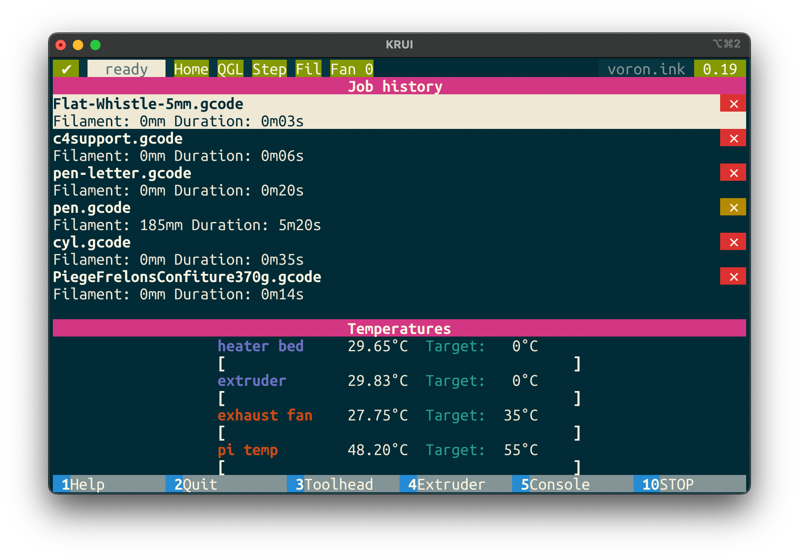

<h1 align="center">
  KRUI
</h1>

<h4 align="center">A CLI Moonraker client for your Klipper enabled 3D printer.</h4>

  <a href="#key-features">Key Features</a> •
  <a href="#how-to-use">How To Use</a> •
  <a href="#license">License</a>

## Key Features

* Print from job history
* Display information while printing file
* Show gcode preview if available
* Show heaters and fans temperatures and allow to set target
* Show toolhead position and home axes.

## How To Use

[Install rust and cargo](https://rustup.rs/) and then run `cargo install krui` to install the application.

You will then be able to run `krui 192.168.1.121` if your 3D printer is at that IP address.

## License

MIT

---

> [jfoucher.com](https://jfoucher.com) &nbsp;&middot;&nbsp;
> GitHub [@jfoucher](https://github.com/jfoucher)

